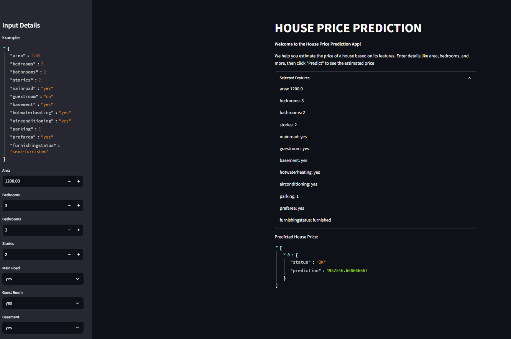

# Kubeflow pipeline & Kserve - House Price Prediction

## Table of Contents
* [About the Project](#about-the-project)
* [Author](#author)

<!-- About THE PROJECT -->
## [About The Project](#about-the-project)

This project focuses on using Kubeflow Pipeline and KServe to facilitate house price prediction without getting into model building details. Split into two phases due to my local resource constraints:

1. Developing a Kubeflow Pipeline for model training and storage. (Folder training)
2. Deployment involves Kubernetes with Docker, FastAPI, and Supervisorctl for the continuous operation of the API.

Also include streamlit file to enable users to easily send requests and interact with the deployed model. If you opt to deploy streamlit on Google Cloud Platform (GCP), you can use App Engine for lower price and ease of management compared to Cloud Run.

## [Author](#author)
Deviyanti AM [linkedin](https://linkedin.com/in/deviyanti-am)