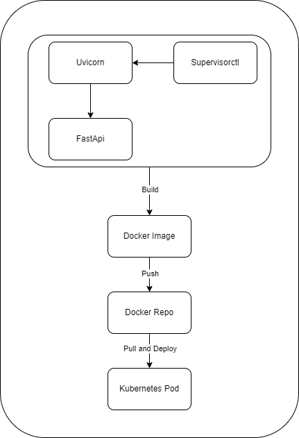
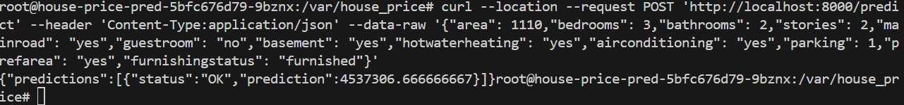
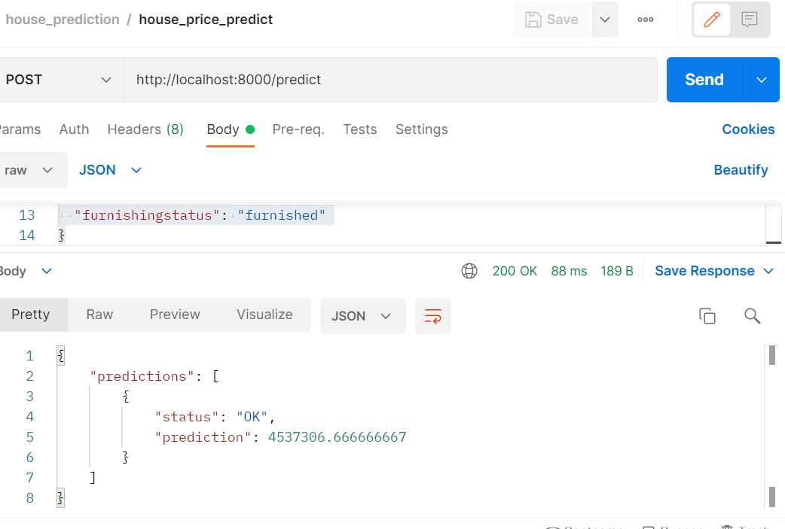
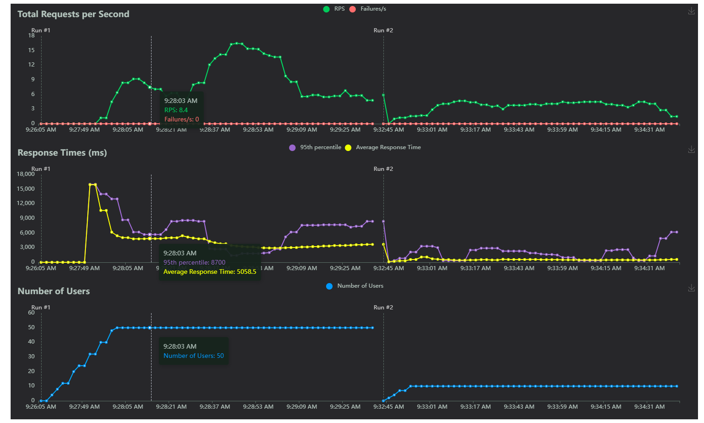

# KServe - House Price Prediction

## Table of Contents
* [About the Project](#about-the-project)
    * [Pipeline](#pipeline)
* [Getting Started](#getting-started)
    * [Prerequisites](#prerequisites)
    * [Instruction](#Instruction)
    * [Environment Variable](#environment-variable)
    * [Testing](#testing)
* [Author](#author)

<!-- About THE PROJECT -->
## [About The Project](#about-the-project)

In this project, we have developed a machine learning model to predict house prices based on various features such as area, number of bedrooms, bathrooms, stories, and amenities like main road access, guest room availability, basement, etc.

To make this model accessible for real-world use, we have containerized it using Docker and deployed it on Kubernetes for scalability and ease of management.



### [Pipeline](#pipeline)

## [Getting Started](#getting-started)

### [Prerequisites](#prerequisites)
* Docker Desktop [instruction for installation](https://www.docker.com/products/docker-desktop/)

### [Instruction](#Instruction)
Also include unittest (before build docker images) and load testing (after deployment).

1. Build and push image to docker hub
```
cd app
docker build -t username/house-price-pred:v1 .
docker push username/house-price-pred:v1
```
2. Verify by running docker
```
docker run -p 8000:8000 username/house-price-pred:v1
```
2. Create namespace
```
kubectl create namespace house-price-pred
```
3. Edit image in deployment.yaml and Deploy app
```
kubectl apply -f deployment.yaml
```
4. Create service
```
kubectl apply -f deployment.yaml
```
5. Check pod or deployment status
```
kubectl get pods -A
kubectl get deployments -A
```
6. Send the request with 2 options
* run the image
```
kubectl exec -it pod_name -n house-price-pred
```
then send request
```
curl --location --request POST 'http://localhost:8000/predict' \
--header 'Content-Type: application/json' \
--data-raw '{
  "area": 1110,
  "bedrooms": 3,
  "bathrooms": 2,
  "stories": 2,
  "mainroad": "yes",
  "guestroom": "no",
  "basement": "yes",
  "hotwaterheating": "yes",
  "airconditioning": "yes",
  "parking": 1,
  "prefarea": "yes",
  "furnishingstatus": "furnished"
}'
```



* port forward and connect the app in your local machine (in my case, I use postman)
```
kubectl port-forward house-price-pred-5bfc676d79-9bznx -n house-price-pred  8000:8000
```



7. Load test
tried 2 scenarios in locust,

    1. the number of users = 50 & spawn rate = 2 & duration 2m
    2. the number of users = 10 & spawn rate = 1 & duration 2m

where

- Number of Users: This determines the total load on the system being tested. More users mean more simultaneous interactions with the system
- Spawn Rate: This controls the rate at which users are introduced into the system. A higher spawn rate means more users are added quickly, ramping up the load on the system faster


given chart, it shows that the response time increases a lot when running with 50 users (95th percentile ~4000ms) but when running with 10 users, it get faster (400ms). For thorough analysis, we can compare the cpu usage and memory usage between those 2 scenarios. But for now, I'd say the system works well up to 10 users.

### [Environment Variable](#environment-variable)
The project is configured via environment variables, i.e. file `.env`.

## [Author](#author)
Deviyanti AM [linkedin](https://linkedin.com/in/deviyanti-am)
