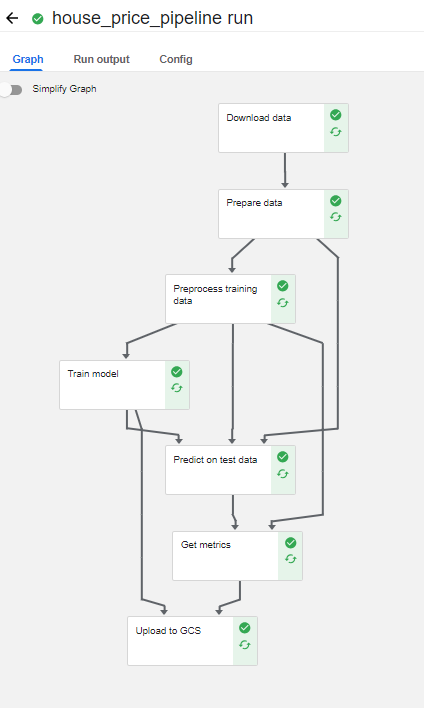

# Kubeflow Pipeline - House Price Prediction

## Table of Contents
* [About the Project](#about-the-project)
    * [Pipeline](#pipeline)
* [Getting Started](#getting-started)
    * [Prerequisites](#prerequisites)
    * [Instruction](#Instruction)
* [Author](#author)

<!-- About THE PROJECT -->
## [About The Project](#about-the-project)

This project solely focuses on leveraging Kubeflow Pipeline for house price prediction, from organizing data, training model to saving model. To note we dont discuss the technical aspects of model construction.

### [Pipeline](#pipeline)


## [Getting Started](#getting-started)

### [Prerequisites](#prerequisites)
* **Docker Desktop** [installation](https://www.docker.com/products/docker-desktop/)
* minikube [installation](https://minikube.sigs.k8s.io/docs/start/)
* under folder serving/kubeflow, clone kserve 
```
git clone https://github.com/kserve/kserve.git
```
* download istio and unzip under folder kubeflow
https://github.com/istio/istio/releases/tag/1.17.2


### [Instruction]

(#Instruction)
Data: [here](https://www.kaggle.com/datasets/yasserh/housing-prices-dataset)
1. Make sure you can open kubeflow pipeline UI at http://localhost:8080/
2. create py env, 3.8 and install libraries from the requirements.txt file
3. Follow instructions in ipynb. If all set, execute ipynb file

## [Author](#author)
Deviyanti AM [linkedin](https://linkedin.com/in/deviyanti-am)